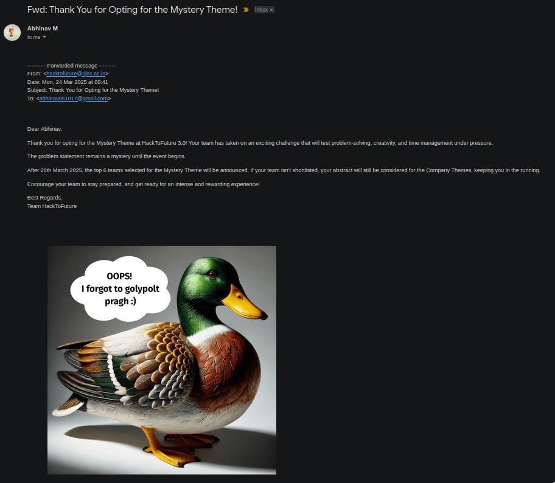
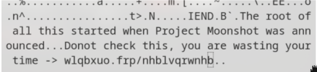

Recently, I took part in a hackathon named [HackToFuture 3.0](https://unstop.com/hackathons/hacktofuture-30-st-joseph-engineering-college-mangaluru-1380851) at St Joseph Engineering college at Mangaluru. This was in-fact my first competitive hackathon outside my home state, and it was quite an enriching experience as i got to dabble with AI, RAG and all that jazz to build our project - [DocMate](https://github.com/ItsAbhinavM/DocMate).

However, this blog isn't about the hackathon, nor is it about our project. Nay, it's about something, which is in my opinion, much more interesting. You see, the unique thing about this hackathon is that it had something called as the **Mystery Track**. 

## Mystery Track
The mystery track was a track in which the problem statement would only be released a few mins prior to the hackathon, sound like a challenge? Well we're not done yet, the stakes are also higher! The mystery track would only have one winnner, and this winner would take everything home.

They didn't just stop there though, in order to make it more interesting, the organizers cooked up an entire ARG for curious participants to decipher and discover the problem statement prior to the hackathon.

## ARG? What's that?
An [ARG](https://en.wikipedia.org/wiki/Alternate_reality_game) stands for Alternate Reality Game, it's like a sort of interactive narrative that uses the real world as a platform to tell a story. One of the most famous ARG's that you may have heard about is Cicada 3301:


## Mr Goose Introduces Himself
The first clue came in an incospicuous email confirming our registration for the mystery track:
<br>
Hang on a second... What is a picture of a random duck doing there? This is when I realized the mystery track was hiding something more than just the problem statement. Instantly, my nerves from my CTF days kicked in and I guessed that some data was hidden in this image using image steganography.

And sure enough, `exiftool` confirmed my suspicion:
```sh
~/Downloads -> exiftool goose.png
ExifTool Version Number         : 13.25
File Name                       : goose.png
Directory                       : .
File Size                       : 2.1 MB
File Modification Date/Time     : 2025:03:24 21:01:20+05:30
File Access Date/Time           : 2025:03:29 22:42:50+05:30
File Inode Change Date/Time     : 2025:03:24 21:01:20+05:30
File Permissions                : -rw-r--r--
File Type                       : PNG
File Type Extension             : png
MIME Type                       : image/png
Image Width                     : 1536
Image Height                    : 1536
Bit Depth                       : 8
Color Type                      : RGB
Compression                     : Deflate/Inflate
Filter                          : Adaptive
Interlace                       : Noninterlaced
Warning                         : [minor] Trailer data after PNG IEND chunk
Image Size                      : 1536x1536
Megapixels                      : 2.4
```

Minor trailer data after PNG IEND chunk? This calls for a hex dump, and boom:
<br>
The link in the text above is ciphered using the [caesar cipher](https://en.wikipedia.org/wiki/Caesar_cipher) a very simple substitution cipher in which every letter is substituted with another one which is at a fixed distance. Running this text through a caesar decoder with a shift length of 3, yields the following URL: [tinyurl.com/keyisnotkey](tinyurl.com/keyisnotkey). The website might be down by the time you read this, but it yields yet another image.

This is the point at which I realized that I was dealing with an ARG. Truth be told, this probably could not have happened at a worse time as i was knee deep into my mid-semester exams but I just could not give up on the opportunity to solve a mystery like this.
