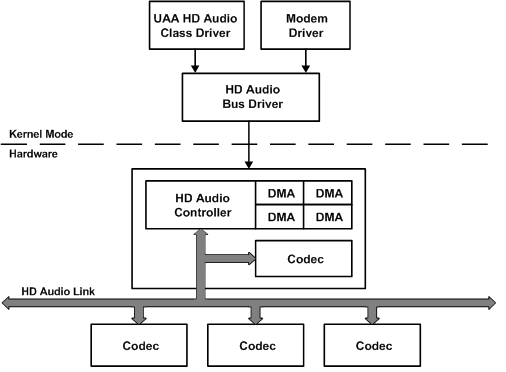

This blog post has been long overdue but I've finally gotten around to it! I graduated from the Linux Kernel Bug Fixing Mentorship Programme'25 sometime in late january. I'll be detailing my experience about the same in this blog post.

## What is the LKMP?
The Linux Kernel Mentorship programme or [LKMP](https://wiki.linuxfoundation.org/lkmp) for short is, as written on their website -
> "A structured remote learning opportunity for aspiring Linux Kernel developers"

In specific, the programme that I was part of was the Linux Kernel Bug Fixing Programme but don't let the name fool you, you can do a lot more than just fix bugs, like writing new device drivers or extending existing ones.

In short, its an opportunity where beginners to kernel dev can get their feet wet with the Linux Kernel while being supported by experienced mentors. Note that unlike GSoC or traditional [LFX](https://lfx.linuxfoundation.org/tools/mentorship/) mentorships, the kernel bug fixing mentorship is an unpaid one but the knowledge you get from the whole process is worth its weight in gold.

If, however, you're someone who needs a little more motivation than that then you should probably look elsewhere as you can only ever do one LFX mentorship during your lifetime. Choose wisely :)

### The structure of the program
I would say that the LKMP is a very flexible program in the sense that there is no roadmap or particular set of tasks that you have to complete in order to graduate. You are free to make any kind of meaningful contribution to the kernel, this opens the door to work on anything that you're truly interested in. This coupled with the fact that you get to attend weekly meetings with experienced kernel developers makes it a very enriching experience.

The only requirements for graduation is that you need to have around **5-10 patches** accepted into the Linux Kernel by the end of the program. This might seem difficult at the start, but trust me, once you get into the flow of things, it becomes a breeze.

## Why I decided to join the programme
There's actually a bit of an interesting backstory behind this, when I first bought my laptop (an Acer Nitro 5) and installed Linux on it ( as one does with a brand new PC, *obviously* ) I noticed that no matter what I tried, I just could not get the headphone jack to detect the microphone.

This is an issue that I had revisisted multiple times over the course of a year and it had even persisted across distros! This led me to believe that the issue was in the kernel and sure enough, after a bit of research this had been the case.

Around this time a few of my [club](https://www.amfoss.in) seniors suggested me to try out the LFX mentorship since I wanted to explore low level development and I figured that it was the perfect opportunity to try and fix this tiny (but very annoying!) problem. As Plato once said -
> "Necessity is the mother of invention"
>  -- <cite>Plato</cite>

## My contributions
### Fixing microphone input on the ALC287 Codec
After a bit of research, I stumbled upon this excellent blog [post](https://asus-linux.org/blog/sound-2021-01-11/) by Luke Jones on his adventure for getting sound to work on Asus ROG notebook. If it were not for this resource, this journey would have been much, much longer.

Through his blog I understood a lot of fundamentals regarding how audio is handled for Realtek Codecs on Linux but wait a minute Hridesh, what on earth is a Codec? Let me explain it with the help of an image -
> 

As you can see the **Codec** is a hardware chip on the motherboard which is responsible for controlling the speakers and microphone on the system. The kernel interacts with this chip using the I2C interface, but we don't need to go that deep to fix our issue.

The problem that occurs here is that this codec expects the software to interact with it in a certain manner. However, Realtek, in all their glory, often ship these chips with non-standard configurations, meaning they don't always properly report their capabilities to the operating system. Instead, they rely on driver-specific **quirks** to function correctly.

The issue is that these quirks are only implemented in the Windows driver, leaving Linux users to manually patch or configure the kernel to get everything working. The result of this? A giant file in the kernel tree named [patch_realtek.c](https://web.git.kernel.org/pub/scm/linux/kernel/git/torvalds/linux.git/tree/sound/pci/hda/patch_realtek.c?h=v6.14) which has (at the time of writing) over 13,000 lines of patches for various different codecs.

After digging a bit deeper into it and experimenting a bit, I finally got it to work after reverse engineering the windows driver and figuring out which quirk was missing! This was my reaction after finally see the mic input meter start moving -

Apparently, the quirk that I had found out was already defined in the `patch_realtek` file, so all I had to do was map it to my codec. I quickly made a [patch](https://web.git.kernel.org/pub/scm/linux/kernel/git/next/linux-next.git/commit/?id=5a69e3d0a1b0f07e58c353560cfcb1ea20a6f040) and submitted it and it finally got released in v6.13 of the kernel. This means that everyone who has my laptop or uses the same audio codec can finally enjoy working microphone input.

### Enabling Turbo support on my laptop
The second contribution is the one I spent the most amount of time on and it's where I realized how awesome the kernel community really is. My laptop is a gaming laptop and gaming laptops often have this feature where you can activate certain **profiles** like "performance" or "quiet".

These profiles enable you to extract more power from your machine by overclocking the CPU/GPU or tell it to slow down the fans so that it runs more quietly. However, these profiles are only accessible on Windows through the dedicated vendor app. 

I was initially skeptical as to whether it was even possible to bring this support to Linux, which prompted me to send an email to the kernel mailing list asking for help. The developers there were extremely supportive and they even offered to write the patch for me! However, since I wanted to learn and tinker with it, I endeavoured to try and implement it myself.

Through the process, I learnt about a variety of different things like ACPI tables, WMI calls, sysfs interfaces, and even did some indepth reverse-engineering using Ghidra and dotPeek to find out how the Windows app worked underneath the hood. A full technical write up on this would warrant another blog post, so keep an eye out for that ;)

If you're interested however, here is a [link](https://docs.google.com/document/d/1p9wXSrygZ4AMlPRQRoL19wldNuA2GWc_esUgVjJfgeg/edit?usp=sharing) to a few rough notes that I kept while reversing. Beware though! They are a bit unreadable.

## My experience
The LKMP has been one of the most impactful programs that I've participated in. You might find this surprising, but the majority of kernel developers aren't actually paid for their work, they do everything voluntarily and their enthusiasm is nothing short of infectious.

Taking part in this whole process really taught me a lot, the kernel community has very high standards when it comes to code quality. I've had maintainers painstakingly take apart each line in my patch to suggest improvements and question logic but don't be scared of this! In fact, this level of scrutiny is what makes the kernel so robust. Every comment from a maintainer is an opportunity to learn, not just about kernel code but about writing efficient, clean and maintainable code.

I feel like the way I approach code has fundamentally changed after taking part in the LKMP. For starters, I've become much more conscious of the changes that I make and running `git diff` to verify my logic before every commit has pretty much become second nature to me.

Debugging issues in a codebase as large and complex as the Linux Kernel has also given me the confidence that if I put my mind to it, I can tackle any problem, no matter how large it may seem. It wouldn't be an exaggeration to say that I've improved significantly as a developer after completing the programme.

## Conclusion
I think I'll just end this post by saying that if you've been meaning to explore kernel development or just become a better developer overall, the LKMP is a fantastic opportunity. The learning curve might be a bit steep, but as they say - "Its the hard things in life that are worth doing."

Here is a link where you can check out all of my contributions to the kernel: https://web.git.kernel.org/pub/scm/linux/kernel/git/next/linux-next.git/log/?qt=author&q=hridesh
