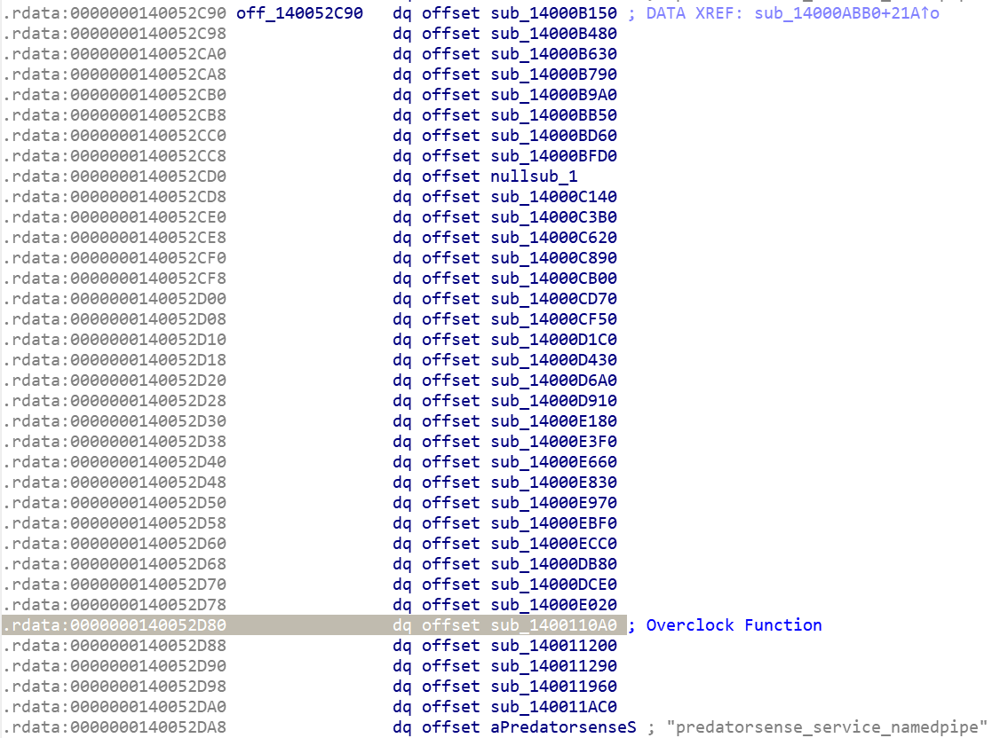
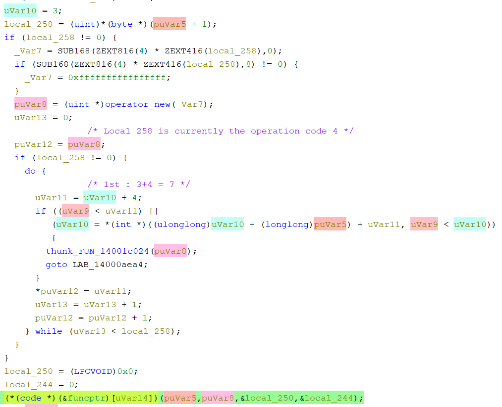
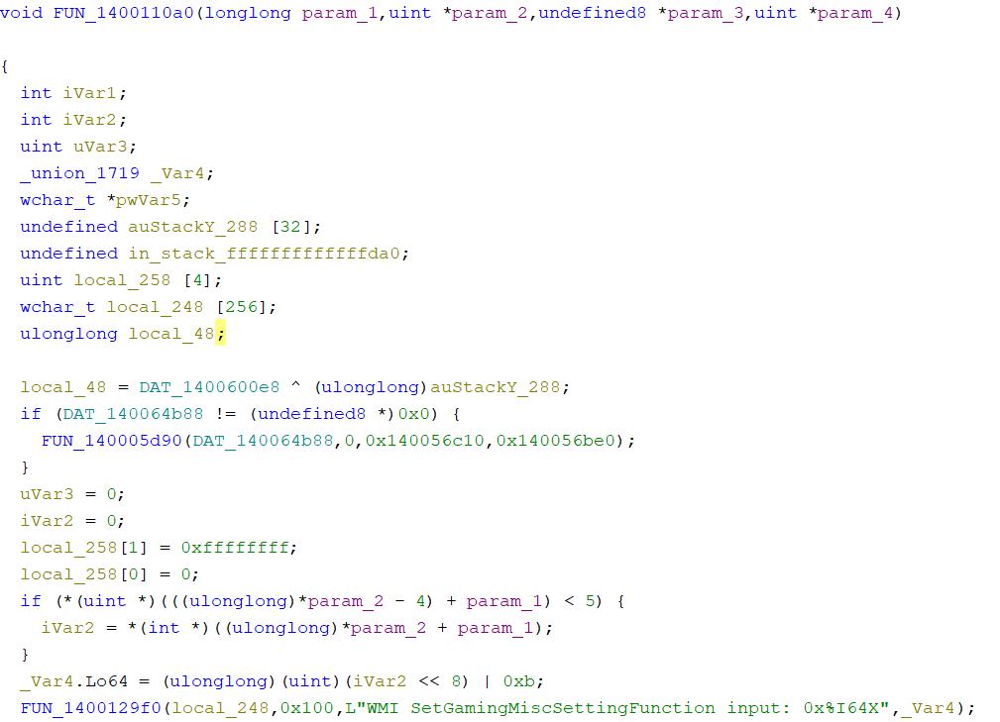

As promised on my [blog post]() about the  Linux Kernel mentorship program, this article will be about my endeavours in trying to enable turbo support for my laptop on Linux.

## How it all began
It all started one day when I was sitting in front of my laptop completely zoned out. My eyes glanced upon the keyboard and I caught myself staring at a key which usually opens an app to change performance profiles of the laptop.

Now, much to the surprise of nobody, this key did not do anything on Linux since the NitroSense app (as is the case with most proprietary software) only works on Windows, regardless, I still wondered if it was possible to change thermal profiles on Linux. To my surprise, someone had already made a [kernel module](https://github.com/JafarAkhondali/acer-predator-turbo-and-rgb-keyboard-linux-module) for this purpose! Unfortunately (or fortunately, since we wouldn't have this article otherwise :)) it only supported the Acer Predator Series of laptops, whereas my laptop was from the Nitro Series.

Anyways, it proved as a good starting point and while going through the source code of the project, I realized that this module was nothing more than a modified fork of a module from the platform profile subsystem on the kernel tree.

## Let the tinkering begin!
### Finding The Hidden Interface
After a brief skim through the project, I understood that things like RGB LEDs, fan profiles and certain other hardware related functionalities are often controlled through something known as [WMI](https://en.wikipedia.org/wiki/Windows_Management_Instrumentation), during this phase I also chanced upon a youtube [miniseries](https://www.youtube.com/watch?v=97-WNhUmoig&list=PLv2kA4LxAI4Dq2ic_hU9bdvxIzoz5SzBr) created by the author of the project which gave me some great insight into how this project works under the hood.

In short, the WMI [interface](https://docs.kernel.org/wmi/acpi-interface.html) allows software to communicate with the hardware by sending certain commands. These commands are handled by special WMI entries defined in the ACPI tables stored in the system firmware. That's a whole lot of words just to say — system send command, hardware do thing.

### Playing around with WMI
First off I started by randomly tweaking a few values in the source code (*sidenote: you probably shouldn't be doing this at the kernel level!*) and briefly got my fans to spin to their maximum speeds but the thermal profiles did not seem to budge, my CPU was still throttled at a respectable 3.2 GHz and I was none the wiser<br>Regardless, this confirmed my assumptions regarding WMI and thus I booted into Windows to monitor WMI activity and sure enough, whenever I changed thermal profiles using the app, a WMI event was registered on the [Windows Event Viewer](https://en.wikipedia.org/wiki/Event_Viewer).

The monitor told me that two WMI functions - `SetGamingFanBehavior` and `SetGamingMiscSetting` were called for changing fan speeds and applying overclocks respectively. Just knowing this alone wasn't enough though, I also needed to know what inputs are fed into these methods so that they actually do something. The event viewer, sadly, provided no means to track inputs.<br>

### WMI Explorer
Initially, I tried to do some trial and error using a tool I discovered called [WMI Explorer](https://github.com/vinaypamnani/wmie2) to manually invoke these functions but it didn't seem to do anything. I later realized that the only way to figure out the required inputs was to reverse engineer the program which calls the function.

I also made a small documentation [patch](https://web.git.kernel.org/pub/scm/linux/kernel/git/next/linux-next.git/diff/Documentation/wmi/driver-development-guide.rst?id=98e45f0d7b99ceac029913ce3a161154a8c4c4a7) during this time to mention this neat little tool in the WMI driver development [guide](https://docs.kernel.org/wmi/driver-development-guide.html).

## Reversing the NitroSense app
Thus it began, my first foray into reverse engineering a real app. The NitroSense app was written in C# and thus I used dotPeek to decompile it.
### Fan Modes Cracked
While searching for the input values for the overclock WMI call, I coincidentally chanced upon the function that was responsible for setting the fan modes —
```C
public static bool set_all_fan_mode(CommonFunction.Fan_Mode_Type mode_index)
{
  ulong intput = 9;
  switch (mode_index)
  {
    case CommonFunction.Fan_Mode_Type.Auto:
      intput |= 4259840UL;
      break;
    case CommonFunction.Fan_Mode_Type.Max:
      intput |= 8519680UL;
      break;
    case CommonFunction.Fan_Mode_Type.Custom:
      intput |= 12779520UL;
      break;
  }
  return ((int) WMIFunction.SetAcerGamingFanGroupBehavior(intput).GetAwaiter().GetResult() & (int) byte.MaxValue) == 0;
}
```

As we can see, input values of the WMI function are readily available here! There are three magic values which correspond to the three different fan modes. Was a bit surprised to the see the typo in the 'intput' variable, kind of refreshing to know that even billion dollar companies have such mistakes in their code lol.

### In Search Of Overclocks..
The overclock function was sadly not as simple of an egg to crack. I traced through the GUI code for the app and narrowed it down to this particular function -
```C
public static async Task<int> set_operation_mode(int Operation_Mode)
{
  int output = -1;
  try
  {
    NamedPipeClientStream cline_stream = new NamedPipeClientStream(".", "PredatorSense_service_namedpipe", PipeDirection.InOut);
    cline_stream.Connect();
    output = await Task.Run<int>((Func<int>) (() =>
    {
      IPCMethods.SendCommandByNamedPipe(cline_stream, 30, (object) (uint) Operation_Mode);
      cline_stream.WaitForPipeDrain();
      byte[] buffer = new byte[9];
      cline_stream.Read(buffer, 0, buffer.Length);
      return BitConverter.ToInt32(buffer, 5);
    })).ConfigureAwait(false);
    cline_stream.Close();
    return output;
  }
  catch (Exception ex)
  {
    return output;
  }
}
```
Don't worry if it all looks like gibberish to you, it did to me as well when I first came across it. Since i was wholly unfamiliar with the Windows API, I asked ChatGPT to explain the code to me like a 5 year old. GPT promptly explained that this function was creating something called a ["Named Pipe"](https://en.wikipedia.org/wiki/Named_pipe) which is used for inter-process communication.

Uh oh, this meant that the actual WMI call was was being made by a process on the receiving end of this pipe. Interestingly, I noted that the name of the pipe was 'PredatorSense_**service**', suggesting that the recipient process was a service.

While we are here, let me also comment that the `Operation_Mode` argument of `set_operation_mode()` took one of three values: 0, 1 or 4. Which makes sense considering that my lapop has three performance modes.

### The Final Piece Of The Puzzle
Sure enough, there was indeed a service in services.msc named `Predator Service`, the service started a program called `Pssvc.exe`. This particular program was written in C++, I initially used IDA to disassemble it before realizing that I had pretty much 0 knowledge of assembly ;-;

That's when I remembered Ghidra, a reversing tool developed by the NSA, that I had used during a CTF contest that I had played a long time ago. Ghidra tries its best to produce a readable C-like program from the disassembled code.

After some heavy decompiling on the service file using Ghidra I finally found out that the value is read from the named pipe and then used to call a function from a function pointer table as follows:
```C
(*(code *)(&PTR_LAB_140052c90)[uVar14])(puVar5,puVar8,&local_250,&local_244);
```
Here, `&PTR_LAB_140052c90` refers to the following function pointer table -



If you remember from [earlier](#in-search-of-overclocks), a command index of 30 was passed into the named pipe along with the Operation Mode. This index corresponds to the function pointer that I've highlighted in the image. 

I still needed to know what the arguments are for this function, here is the relevant section of the code which receives the input from the named pipe and calls this function —



Yes, it's one hell of a monstrosity—but after staring at it for a long time, I figured out that all it does is pass an array of bytes from the named pipe with their corresponding byte offsets to the function. You can observe this in the last line of code which actually performs the function call, `puVar5` is the array of bytes and `puVar8` are the byte offsets (I think anyways)

### Jackpot
Finally, we are ready to analyze the function that makes the WMI call —



This function dereferences the values from the byte array and performs a bitwise operation (`value << 8 | 0xb;`) on them before passing them to the WMI call. Doing this manually on the `OperationMode` values from earlier, we get the following values for WMI calls:
```rust
//SetGamingMiscSetting
Performance: 1035
Default: 267
Quiet: 11

//SetGamingFanBehavior
Custom: 12779520
Auto: 4259840
Max: 8519689
```
Using WMI Explorer to call this function with this values does indeed change performance profiles and fan speeds! All of this reversing had finally paid off! Or so I thought..

## Writing The Patch
After all of that work—reverse engineering the NitroSense app and painstakingly obtaining the correct values, I was ready to write my patch. Which is when I discovered that the kernel module, [acer-wmi](https://git.kernel.org/pub/scm/linux/kernel/git/torvalds/linux.git/tree/drivers/platform/x86/acer-wmi.c), which adds WMI functionality to Linux for my laptop already had all of the above values defined! 🙃

Now this truly threw me for a loop, if someone had already taken the time to reverse these values why weren't they working on my laptop? Initially I thought this was because my turbo button was not producing a WMI event when pressed.

I [reached out](https://lore.kernel.org/platform-driver-x86/CALiyAom1xDH6A0Q2WNHCMUcpMJfM3pXO2DaW=bgHGUi8ZOpBbQ@mail.gmail.com/) the maintainers on the platform profile subsystem asking for help and they were more than ready to help. In fact, one of them even offered to write the patch for me! However since my main aim was to learn, I politely refused and he was kind enough to guide me in the right direction.

From there, I learnt about ACPI tables where these WMI functions are defined and the corresponding [tools](https://unix.stackexchange.com/questions/534429/how-to-print-the-acpi-table) used to read them. After scanning through the ACPI code I realized that the Predator and Nitro series of laptops share the same values for the profiles and that the core issue was that the Predator series supports two additional profiles.

The `acer_wmi` module had the `supported_profiles` value hardcoded for the Predator. However, it should have been set dynamically, since the hardware had another WMI call (`GetGamingMiscSetting`) that returns a bitmap indicating the supported performance profiles. This function was simply not being utilised by the current driver. 

Hence, my [patchset](https://lore.kernel.org/all/20250113-platform_profile-v4-0-23be0dff19f1@gmail.com/) essentially involved adding dynamic support for setting the supported platform profiles and some other miscellaneous improvements to the platform profile handling for acer laptops. After these patches got merged, I could finally set my performance profiles from the sysfs [interface](https://docs.kernel.org/userspace-api/sysfs-platform_profile.html) at `/sys/firmware/acpi/platform_profile`!

We weren't done yet though. One last issue I was facing is that on Windows, my CPU was able to reach its max thermal limit of 100°C when operating in performance mode but on Linux, it was throttling at 92°C. I initially tried tweaking CPU frequency scaling drivers and other settings without success. After a lot of trial and error, a maintainer suggested installing [thermald](https://man.archlinux.org/man/extra/thermald/thermald.8.en)—and that ended up solving the problem!


## Conclusion
That just about does it, in this rather wordy blog post I've written down (almost) my complete approach to adding some unsupported functionality for my hardware to the Linux Kernel. Have to say, while it was certainly frustrating at times, it was a great deal of fun. Rarely do you actually get to go down to the basics like ACPI tables or manually juggle bitmasks to solve problems with your laptop. It's hard to explain but there is a sort of raw simplicity operating at such a low level, everything merely does what its meant to do and it does it well. There's no hidden abstractions or sneaky gotcha's that surprise you.

Going through this whole process also made me realize that you can literally solve any problem you have with software, as long as you have the grit to stick with it and see it through.
